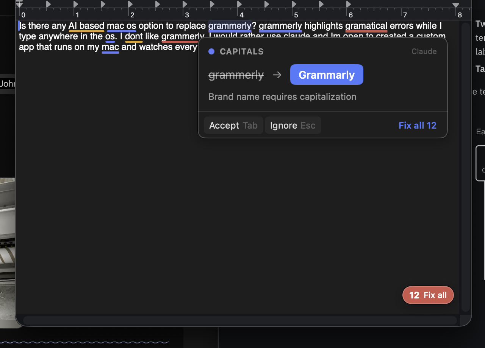
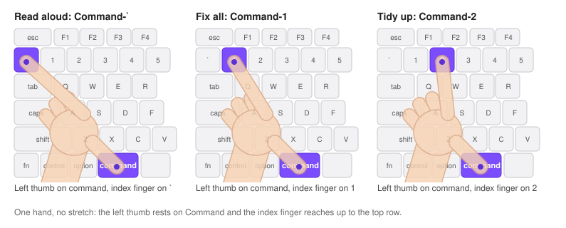

# ClaudeGrammar

A Mac menu bar app that uses Claude to check your writing as you type, in any app: the Claude app, Gmail, Slack, Google Chat, Asana, TextEdit and more. It works like Grammarly.

- **Fixes as you type.** Spelling, grammar and capitals get underlined (red, amber and blue). Hover one to see the fix, and click it or press Tab to take it.
- **Fix all.** A small dot in the corner of the text box counts the mistakes. Hover it and take them all in one click.
- **Tidy up.** For a longer message, Claude offers a cleaner layout: paragraphs split, blank lines between them, and things run together turned into a bulleted or numbered list. One click swaps it in.
- **Your words and names.** Add jargon to your dictionary so it's never flagged, and save names like Sttark with their capital so the app always writes them that way. Web and email addresses are left alone.
- **Translate to Chinese**, with an English check of what the Chinese says.
- **Read aloud**, in a natural voice, at the speed you pick.
- **Shortcuts** you can change for Fix all, Tidy up, read aloud and translate.



*Drawn by the app's own code: the underlines, the dot and both cards as they look in use.*

## Install

You need a Mac on macOS 14 or later, and your own Anthropic API key.

1. Install Apple's command line tools if you don't have them. In Terminal:
   ```
   xcode-select --install
   ```
2. Download, build and install:
   ```
   gh repo clone Sttark/claude-grammar ~/claude-grammar
   ~/claude-grammar/install.sh
   ```
   This puts the app in `~/Applications`, sets it to start when you log in, and opens it.
3. macOS asks you to allow ClaudeGrammar under **System Settings > Privacy & Security > Accessibility**. Turn it on. The app can't see what you type until you do.
4. Paste your Anthropic API key when the app asks. Get a key at [console.anthropic.com](https://console.anthropic.com). It's saved in your Mac's Keychain.

The app is also attached to each [release](https://github.com/Sttark/claude-grammar/releases) as a zip. Because the app isn't signed with an Apple developer account, macOS blocks a downloaded copy the first time you open it. To allow it, go to **System Settings > Privacy & Security** and click **Open Anyway**. Building with `install.sh` avoids that.

## Using it

- Type anywhere. About 4 to 5 seconds after you pause, mistakes get underlined.
- Hover an underline to see the fix. Click the blue fix, or press **Tab**, to take it. **Esc** ignores it.
- **Add to dictionary** stops a word from being flagged. Use it for names and jargon. A word saved with a capital, like Sttark, counts as a name: the app writes it that way everywhere except inside addresses like sttark.com. Edit the list with **My dictionary…** in the menu.
- Web addresses, email addresses and file paths are never flagged.
- A small 12-pixel dot sits in the corner of the text box, away from your text: gray and spinning while it checks, red with the number of mistakes, purple when there's a tidy-up, red with a purple corner when there are both. Hover it for a card with **Fix all** and **Tidy up**, one click each. Click the dot to keep the card open; Esc or a click anywhere else closes it.
- **Command-1** takes every fix (Fix all), and **Command-2** tidies up when the dot is purple. You can change both (see Shortcuts).
- Made-up words get fixed to Claude's best guess from the sentence, using your dictionary, or flagged as not a word if there's no guess. Add your work terms to the dictionary so the guess is right.

### Tidy up

For a longer message, the dot turns purple when Claude has a cleaner version: paragraphs split, blank lines between them, things run together turned into a bulleted or numbered list, and spelling fixed. Hover the dot to see it, and click **Tidy up** to swap your message for it. Command-Z undoes it.

- Claude gets the whole message once you pause, if it's at least 20 words or 3 lines. It keeps your meaning and only rewords what a list needs.
- Tidying selects the whole message and pastes the new version over it in one go. The paste carries a formatted copy, which rich boxes like the Claude app, Slack, Asana and Gmail turn into real lists and bold, and a plain copy with "- " lines for plain boxes. Nothing is typed after, and Return is never pressed, since it would send the message in the Claude app or Slack.
- The one or two details a reader must not miss are made bold, in boxes that keep bold.
- A box that already puts space between paragraphs gets no empty lines, so they don't look doubled.
- In rich boxes like Slack and Asana, tidying turns links and @mentions into plain text.
- Turn it off with **Offer to tidy up** in the menu. It costs about one extra check each time you pause in a long message.

### Translate to Chinese

Select any text, then either:
- click the menu bar icon and choose **Translate selection to Chinese** (works in every app), or
- right-click and choose **Translate to Chinese with Claude**. On some Macs it's inside a **Services** submenu. Some apps, like the Claude app and Slack, don't show it at all.

If the selected text can be edited, it gets replaced with the Chinese. A note shows what the Chinese says in English, so you can check it, and fades after 8 seconds.

If the text can't be edited, like a web page, a card shows the Chinese and the English check instead.

Either way the Chinese is also copied. Select Chinese text and you get English instead.

Translation uses Claude Opus 5, which wrote more natural Chinese than Haiku in testing. A short message costs about half a cent.

### Read aloud

Select text in any app and press **Command-`** (the key above Tab), or choose **Read selection aloud** from the menu bar icon. Reading starts in about a second. Press it again to stop. The menu bar icon turns into a speaker while it reads.

Claude can't speak, so read aloud uses OpenAI's voice model (gpt-realtime-2.1-mini). The first time you use it, the app asks for an OpenAI API key from [platform.openai.com](https://platform.openai.com). It's saved in your Mac's Keychain. The rest of the app doesn't need it.

Pick a speed under **Reading speed** in the menu: 0.75× to 2×. The model speaks at up to 1.5× itself. Above that the app speeds up the playback without raising the pitch.

It costs about a cent per paragraph, or about 20 cents for 1,000 words, billed to your OpenAI key.

### Shortcuts

The three you'll use most sit under your left hand: Command-` reads aloud, Command-1 is Fix all, Command-2 is Tidy up.



Change the read aloud, Fix all, Tidy up and translate shortcuts under **Shortcuts** in the menu. Click one, press the new keys, and click **Save**. A shortcut needs at least one of Command, Control or Option. **No shortcut** turns one off. Translate has no shortcut until you set one.

Fix all and Tidy up only take over their keys while you're in a text box the app is checking, so a key like Command-1 still switches Chrome tabs everywhere else. Two keys to know about:
- **Command-Esc** can't be used: macOS opens the Game Overlay with it before any app sees it (System Settings > Keyboard > Keyboard Shortcuts > Game Controllers turns that off).
- **Option-`** normally starts an accent like à. Used as a shortcut, it can't type accents in the boxes the app checks.

The menu bar icon (an I-beam cursor) has:
- On/off
- Offer to tidy up (paragraphs, lists)
- Skip the app you're in
- Pause for 1 hour
- Read selection aloud, and its reading speed
- Translate selection to Chinese
- Fix all and Tidy up
- Shortcuts
- Model choice
- Today's checks and cost
- My dictionary
- Change API key, and the OpenAI key once you've added one

Terminal, iTerm2, Ghostty, Warp, 1Password and Keychain Access are skipped from the start. Password fields are never readable by any app, and search boxes are skipped.

## Cost and privacy

Each paragraph you write is sent to Claude through Anthropic's API, billed to your API key. A longer message is also sent whole for the tidy-up check. With the default model (Claude Haiku 4.5), one check costs about $0.003. A heavy day of typing comes to around 30 to 50 cents. The menu shows today's total.

The text goes to Anthropic and nowhere else, except text you have read aloud, which goes to OpenAI. The app keeps no copy of it on disk. Results are remembered in memory until the app quits, so unchanged paragraphs aren't sent twice. (The optional log file under Debugging is the one exception, and it's off unless you turn it on.)

## Troubleshooting

- **Nothing gets underlined.** Make sure ClaudeGrammar is on in System Settings > Privacy & Security > Accessibility. A triangle in the menu bar icon means it's missing that permission or a key.
- **It worked, then stopped after an update.** Reinstalling makes macOS treat the app as new, so its Accessibility permission has to be turned on again.
- **Underlines in the wrong place, or none in one app.** Some apps don't tell other apps where their text sits on screen. Use Skip in the menu for that app.
- **Read aloud stops when you switch speakers.** Connecting or dropping AirPods mid-read stops it. Press the shortcut again to start over on the new speaker.
- **Command-` no longer switches windows.** Read aloud uses it. Change it under Shortcuts if you want it back.
- **A shortcut won't record.** macOS keeps some keys for itself before any app sees them, like Command-Esc (see Shortcuts). Pick another.
- **Red dotted underlines that aren't from ClaudeGrammar.** Chrome and the Claude app have their own spell checkers. Chrome's is under Settings > Languages > Spell check.

## Update

```
cd ~/claude-grammar && git pull && ./install.sh
```

Turn Accessibility back on afterward (see Troubleshooting).

## Uninstall

```
~/claude-grammar/uninstall.sh
```

This removes the app, the login item, your saved keys, settings, and dictionary.

## How it works

1. Every 0.12 s the app reads the focused text box through the macOS Accessibility API.
2. When you stop typing for 2 s, each changed paragraph of 3+ words goes to Claude, all at once. Claude sends back a corrected copy plus a short reason for each change. Made-up words get a best guess, or are listed with no fix, like "somnerhqw". The app checks sentence-start capitals, end punctuation and dictionary names itself, since Claude sometimes misses those. A message of 20+ words or 3+ lines also goes whole to Claude for a tidy-up.
3. The app compares your text with the corrected copy word by word to get exact positions. A transparent overlay draws the underlines. Chrome-based apps (the Claude app, Slack, web pages) return an empty box when asked where a range of their text sits on screen. For those, the app asks each run of text inside the box instead.
4. Fixes go in through the Accessibility API. Fix all makes one change per line. Apps that ignore it get the fix pasted over a selection, and the clipboard is restored afterward. A fix replaces only the part that changes and never starts or ends with a space, since some boxes (Asana) drop those from a paste. Chrome-based apps count lines differently in their cursor positions than in the text they hand over (list items, blank lines), so the app reads the box's own text, lines the two up, and checks the flagged word is at that spot before replacing it. A word at the end of a line is selected all but its last letter, then Shift-Right, so the selection can't take the line break with it. If the word can't be selected, the fix is skipped instead of pasted.
5. A tidy-up selects the whole message (Command-A) and pastes once, with a formatted copy for rich boxes and a plain copy for plain ones. If the box already spaces its paragraphs, measured on screen, it gets no empty lines.

On a test paragraph with 12 mistakes, Haiku 4.5 caught 11 or 12 in about 3 s. Sonnet 5 (in the menu) took about 4.5 s, cost twice as much, and caught 8 to 11.

### Files

- `Sources/AX.swift`: Accessibility API helpers (focused text box, where text sits on screen, edits)
- `Sources/Checker.swift`: Claude requests and prompts (fixes and tidy-ups), API key storage, the word-by-word comparison, and the checks the app does itself (capitals, end punctuation, names, addresses)
- `Sources/Controller.swift`: main loop, where underlines and the dot go, hover cards, fixes, tidy-ups, keys, menu
- `Sources/UI.swift`: underline overlay, hover card, the corner dot and its card
- `Sources/Translate.swift`: the right-click translate item and its card. It's declared under `NSServices` in `Info.plist`.
- `Sources/Speak.swift`: read aloud. It streams audio from OpenAI's realtime voice model over a WebSocket and plays it as it arrives, with a fresh audio engine for each read so it follows the current speaker.
- `Sources/Shortcuts.swift`: the shortcuts you can change and how they're saved
- `build.sh`: builds `build/ClaudeGrammar.app` for Apple Silicon and Intel
- `install.sh`, `uninstall.sh`
- `mockup.html`: the original design mockup

Settings: `defaults read com.sttark.claude-grammar`. Dictionary: `~/Library/Application Support/ClaudeGrammar/dictionary.txt`. Keys: Keychain items `claude-grammar` / `anthropic-api-key` and `claude-grammar` / `openai-api-key`. `ANTHROPIC_API_KEY` and `OPENAI_API_KEY` environment variables take priority over the Keychain.

### Debugging

- Debug log: `open -a ~/Applications/ClaudeGrammar.app --env CG_DEBUG=1 --stderr /tmp/claude-grammar.log`. It includes the start of each paragraph checked, so delete it when you're done.
- Log file, off by default: `defaults write com.sttark.claude-grammar logToFile -bool true`, then restart the app. Fixes and tidy-ups, including the text sent for each tidy-up check, are noted in `~/Library/Logs/ClaudeGrammar.log`, which starts over past 1 MB. `defaults delete com.sttark.claude-grammar logToFile` turns it off.
